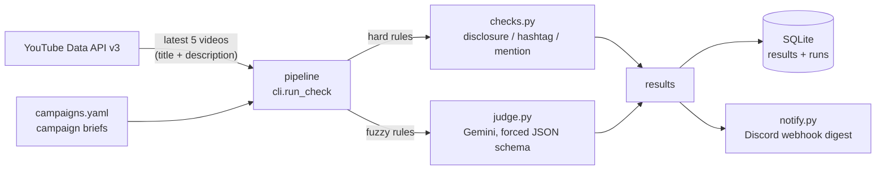

# BriefPulse

Daily campaign-compliance checker. Every morning it pulls each campaign creator's latest
YouTube posts, checks them against the campaign brief, stores the results, and posts a
digest to Discord flagging anything non-compliant. Nobody has to open creator videos one
by one to see whether the #ad disclosure and the campaign hashtag are actually there.

## The problem

When an influencer campaign is live, someone on ops checks every new sponsored post by
hand: is the sponsorship disclosed, is the campaign hashtag present, is the brand named,
does the post actually cover the agreed talking points, does it make claims the brand
can't stand behind. It's repetitive, it scales with the number of creators, and a missed
disclosure is a real compliance problem. This tool automates the daily sweep and turns
the human job into "look at the flags in Discord".

Context: this is deliberately the same shape as the automation stack Content Lab already
runs (Sheets-style config + scheduled jobs + Discord). I also run
[CreatorPulse](https://github.com/loudiman/creator-pulse), a daily creator-metrics
pipeline in production on a VPS; BriefPulse is the compliance/LLM slice of that same
world, scoped to this challenge's time budget.

## What it does

For each campaign in `campaigns.yaml`, for each creator on that campaign:

1. **Pull** — fetch the creator's 5 most recent videos (YouTube Data API v3, key-only,
   2 quota units per creator).
2. **Check** — run 5 rules against each video's title + description:
   - `disclosure` (code): `#ad` or `#sponsored` present
   - `hashtag` (code): campaign hashtag present
   - `mention` (code): brand named
   - `talking_points` (LLM): required talking points actually covered
   - `banned_claims` (LLM): nothing resembling the campaign's banned claims
3. **Store** — SQLite (`results` per video×rule, upserted idempotently; `runs` summary).
4. **Notify** — Discord webhook digest: totals, one line per flag with the reason, and a
   failures section naming any creator whose fetch/judgement failed.

Hard rules are deterministic code — they never go to the LLM. Fuzzy rules go to Gemini
with a forced JSON schema; anything malformed degrades to `unclear` (a human looks), never
to a silent pass.

## How to run

Python 3.12.

```
py -3.12 -m venv .venv          # Windows; python3.12 on Linux/macOS
.venv\Scripts\activate
pip install -e ".[dev]"
copy .env.example .env          # then fill in the three values
briefpulse check --dry-run      # prints the digest instead of posting it
briefpulse check                # full run, posts to Discord
```

Tests and checks (no network, fixtures only — this is CI's gate too):

```
ruff format --check .
ruff check .
mypy src/
pytest
```

Scheduled run: `.github/workflows/daily.yml` fires daily at 08:00 Asia/Manila and on
manual dispatch, with the three secrets configured in the repo settings.

## Architecture



Components (`src/briefpulse/`):

| module | job |
|---|---|
| `cli.py` | orchestration: pull → check → store → notify, per-creator failure isolation |
| `config.py` | load + validate `campaigns.yaml`, loud errors naming the missing key |
| `youtube.py` | YouTube adapter: handle → uploads playlist → latest videos |
| `checks.py` | the three deterministic rules (pure functions) |
| `judge.py` | Gemini prompt, response schema, defensive verdict parsing |
| `db.py` | SQLite store, `UNIQUE(video_id, rule)` upsert = idempotent re-runs |
| `notify.py` | digest text + webhook post |
| `models.py` | frozen dataclasses shared by everything |

## Dependencies

`requests` (YouTube + Discord), `PyYAML` (config), `google-genai` (Gemini). Dev:
`pytest`, `ruff`, `mypy`. SQLite is stdlib.

## Config and credentials

`campaigns.yaml` is the whole business config — a non-technical teammate adds a campaign
or a creator by editing it; no code changes. Credentials via environment (or `.env`,
git-ignored — see `.env.example`):

| variable | what |
|---|---|
| `YOUTUBE_API_KEY` | Google Cloud API key with YouTube Data API v3 enabled |
| `GEMINI_API_KEY` | Google AI Studio key |
| `DISCORD_WEBHOOK_URL` | webhook of the channel the digest posts to |

## Assumptions

- **Title + description are the checkable surface.** Spoken-video content would need
  transcript download; deliberately cut for the time budget (next-day item).
- **YouTube only.** The config schema supports more platforms later; TikTok has no public
  API and Twitch metrics sit behind an auth wall, so neither fits this budget honestly.
- **5 most recent videos per creator** approximates "posts in the campaign window" —
  good enough for a daily sweep; a `published_after` filter is a small follow-up.
- **A daily digest is the right cadence** — this mirrors how the team already consumes
  bot output in Discord.
- **`unclear` beats wrong.** Any malformed/undecidable LLM verdict is surfaced for a
  human, never auto-passed.
- **Free-tier LLM budget is the scaling ceiling.** One Gemini call per video: 2 creators ×
  5 videos = 10 calls/day fits comfortably; ~10+ creators would need batch judging (one
  call per creator) or a paid tier. Calls are paced (12s) with one retry on 429/503.
- **GitHub Actions is the demo scheduler.** Runners are ephemeral, so the SQLite file is
  uploaded as a per-run artifact; a production home would be a small VPS with a
  persistent disk (the CreatorPulse setup).
